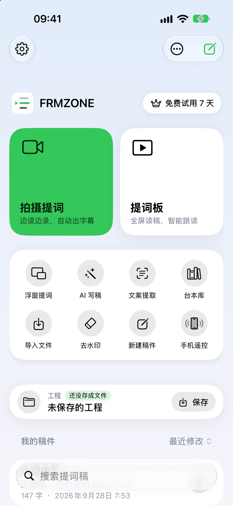
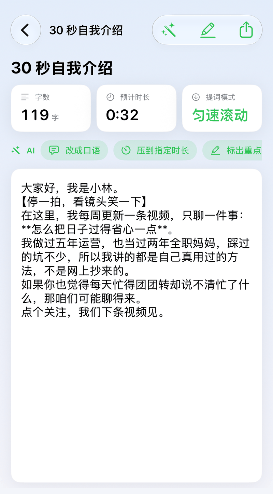
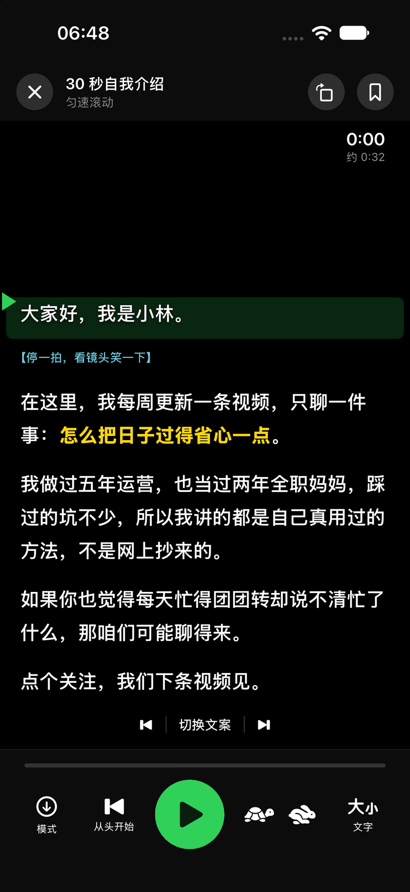
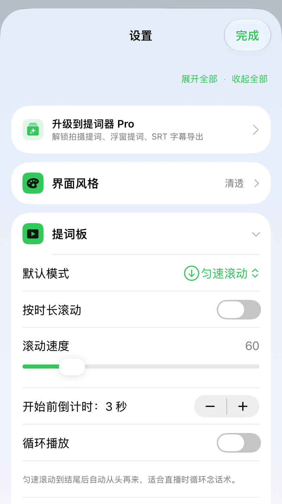
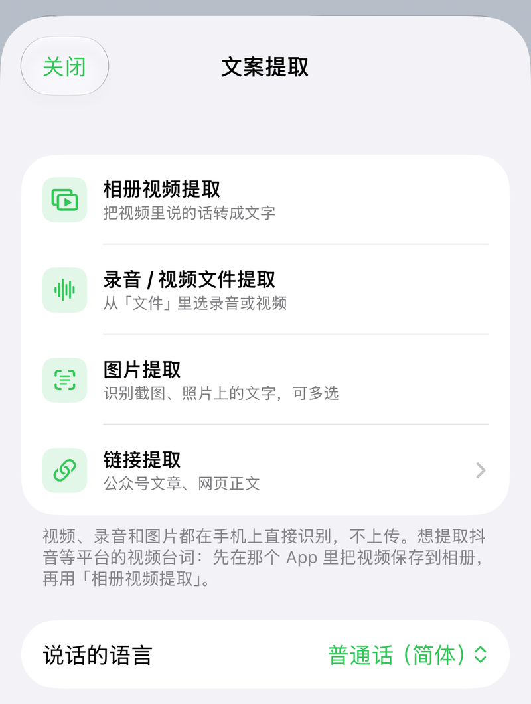
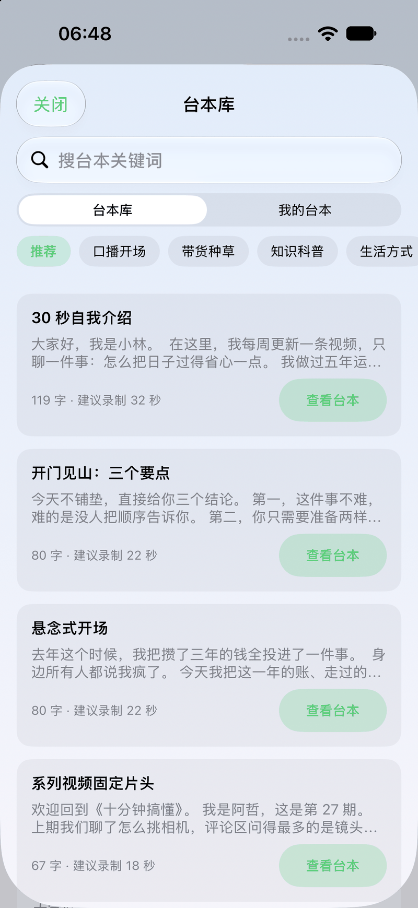
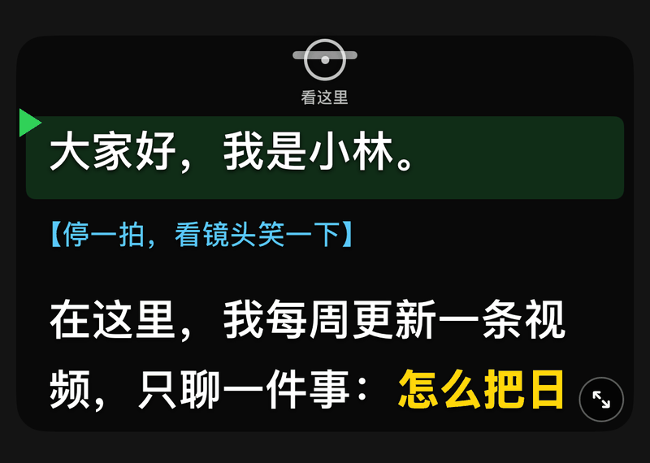
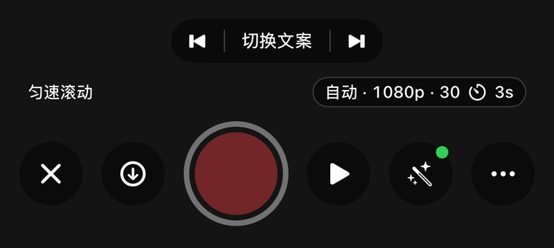
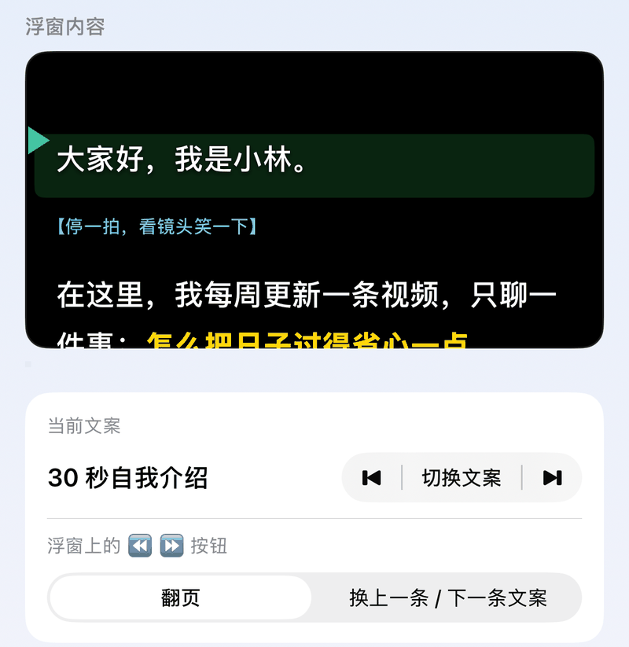

# AI魔方提词器手机版使用说明

**iPhone / iPad · 与应用内「设置 › 使用说明」同步**

## 快速上手
没用过提词器也没关系，跟着下面三步走，几分钟就能念完第一条。

*打开应用就是这个页面。最上面两块大按钮直接开始（默认是「拍摄提词」和「提词板」，引导里选了直播、录课等用途会换成对应的方式）；下面八格是另一种提词方式和常用工具：AI 写稿、文案提取、台本库、导入文件、画面擦除、录音、手机遥控；再往下就是你自己的稿件，每篇右边的 ▶ 直接开始。*

1. **先有一篇稿子**。三种办法随便挑：点右上角的新建按钮自己写（或点「录音」把想法说出来，自动转成稿子）；点「台本库」拿一篇现成的改；点「导入文件」把 Word、PPT、TXT 拿进来（在微信或「文件」App 里也可以直接把文件分享给「AI魔方提词器」）。
2. **点开这篇稿子看一眼**。上面会写着这篇有多少字、大概要念多久，心里有个数。

*稿件页。上面三个小方块是字数、预计时长、提词模式；最下面两个大按钮，左边「提词板」是只读稿，右边「拍摄提词」是边读边录像。*

3. **点「提词板」，开始念**。文字会很大地铺满屏幕，你念到哪里，它就滚到哪里；你停下来，它也停下来。

*提词板。绿色那一条就是「现在该念这里」。*

第一次进来手机会问你要**麦克风**和**语音识别**权限，要点「允许」——不允许的话文字不会跟着你走，只能用匀速滚动。拍视频还会问相机权限。

## 设置在哪
首页左上角的齿轮就是设置。**大部分人只要动前面几项**：界面风格（换颜色）、提词板里的默认模式、滚动速度、开始前倒计时、字号。

*设置页。每一块都能收起来，找不到的时候点右上角「展开全部」。*

## 四种提词模式
不知道选哪个，就先用**智能跟读**——它最省心。
- **智能跟读**：对着手机读，读到哪里文字滚到哪里；停下来它也停。念错了退回去重念，它也跟着退回去。适合口播、录课，也是大多数人该用的那个。「调节」里的**跟读灵敏度**有三档：稳一点（对得更准才往下走，说错、停顿、反复说都不容易乱跳，适合访谈、即兴、直播）、标准（大多数口播、录课）、紧一点（对上一小段就跟上，适合配音、台词校对、快节奏口播）；没选过时按你在引导里选的用途定。中途脱稿即兴说了一串稿子里没有的话，状态栏会显示「即兴中」，这时不会被碰巧相像的话拽走，回到稿子念就接着跟。
  说**粤语**或**上海话**的，到「设置 › 识别语言」选对应的项（这两种要联网识别，不能离线）；带口音的普通话直接用普通话就行。其他方言苹果不支持，用「声控滚动」——它不认字只听声，什么方言都能走。
- **匀速滚动**：文字按固定速度自己往下走，你跟着它念。适合稿子背得很熟、要卡时长的场合。开始前可以倒计时。
  打开「循环滚动」后滚到结尾会自动从头再来，适合直播循环念话术。
  也可以打开「按时长滚动」：设定几分钟读完，速度自动算，到点正好滚到结尾；中途手动拖过也会自己追回来。
- **声控滚动**：介于两者之间——它只听你有没有在说话，不认字：一开口就按设定速度滚，停下就停，换气那一下不会顿。适合智能跟读用不了的场合：方言、口音重、识别不支持的语言、只列提纲的脱稿口播、嘈杂的直播间。不联网、不要语音识别权限。
  背景一直有噪声也没关系，它按最近三秒的底噪自动定「多响算说话」。要是它一直在滚，说明环境太吵，换智能跟读或匀速。
- **手动翻页**：自己划屏幕或用蓝牙翻页器翻。适合访谈、问答这种节奏不定的场合。
提词中随时可以在底部「模式」里换。
稿子里有**生僻字**（龋、忐忑、饕餮这类）会在字上方标小字拼音，常用字不标，不想要可以在「设置 › 颜色」关掉；再打开「数字读法提示」，年份、百分数、小数、大数上方会标怎么念（2024 → 二〇二四，120000 → 十二万）。
录之前想听听效果：提词界面「文字」面板最上面有**先听一遍**（电脑版在编辑区右上角的小喇叭），系统语音按你设定的语速把稿子读一遍，听听节奏、英文名和专业词的发音、哪句太长换不上气。不联网。

## 提词界面

*提词板上每样东西是干什么的，下面一条一条说。*
- **绿色的那一条**：你现在该念这里。念下去它会自己往下走。
- **蓝色的【方括号】**：写给你自己看的提醒，比如「看镜头」「停一拍」。念的时候跳过它就行，它也不会把跟读带偏。
- **黄色的字**：重点词。在稿子里用两个星号把词包起来（像 `**这样**`）就会变黄。
- **右上角的 0:00 和「约 0:32」**：已经念了多久 / 这篇大概要念多久。
- **最下面一排**：「模式」换智能跟读 / 声控 / 匀速 / 手动；「从头开始」回到第一句；中间的大圆钮是开始和暂停；「镜像」左右翻转（开着时图标变强调色）；「调节」里调速度、字号和其他设置。
- **提词中随手调**：底栏「调节」（电脑版是提词窗工具条右侧的滑杆图标，或按 `,`）弹出调节面板：一个固定大小的窗，上面还看得到提词画面，所有设置在里面一条列表上下滑——提词模式、字体字号、行间距 / 段落间距 / 边距、文本位置、文字色 / 背景色、参考线位置粗细颜色、台词渐入、速度与倒计时、循环、位置记忆、列表播放、镜像、计时器（上下 / 左右位置都能选）……改了立刻生效，位置不会跳。右上角 ↻ 一键恢复默认（稿子不受影响）。面板顶上的「设置记忆」可以把当前这一整套存成「记忆1」「记忆2」……数量不限，点一下套用；长按（电脑上右键）改名、用当前设置覆盖或删除。拍摄提词里也有同一个面板（拍摄画面底栏录制键左边的滑杆图标，原来的模式按钮并进了面板顶部），多一组「提词区域」：宽度、高度、背景深浅、镜头准星。配色跟着界面风格走。
- 点一下画面：显示 / 隐藏上下的控制栏；播放时控制栏 3 秒后自动隐藏，计时器不会跟着消失。
- **阅读线可以直接拖**：按住阅读线上下拖动就能改位置，正在读的那一句会跟着线一起走，拖动时右侧显示百分比。
- **手势操作**：左右滑改滚动速度（匀速滚动时），双指捏合改字号，上下滑滚动文字，改的时候画面正中会显示当前数值。不习惯可以在「设置 › 提词模式与滚动」关掉。
- **旋转**：右上角按一次转 90 度（0 → 90 → 180 → 270），配提词器硬件时用。
- **镜像**：底部的「镜像」按钮，配提词玻璃时用。
- **书签**：提词界面右上角的目录 / 书签按钮里，可以在当前位置加书签、点一条跳过去。稿子改过以后书签会按后面的几个字重新定位。
- **多人稿着色**：段首写「张三：」「李四：」的稿子，每个人的段落自动用不同颜色，名字缩小变淡、不参与跟读。「设置 › 文字」里可以关。
- **镜头准星**：拍摄时屏幕正上方有个小圆圈和「看这里」，标出前置镜头的位置——读稿时眼睛容易往下飘，照着它看，成片里就是在看镜头。不需要可以在拍摄设置里关掉。
- **文字描边**：提词文字带一层黑色描边，压在相机画面上（尤其浅色背景）也看得清。「设置 › 文字」里可以关。
- **计时器**：可选正计时、倒计时或两者一起；倒计时可以按稿件预计时长，也可以自己设分秒，剩 30 秒变橙色，超时显示红色「超时」。位置可选顶部、阅读线旁、底部。「计时大小」滑块可以把时间调大到两倍。拍摄提词里时间放在提词区里，位置同样按这两项设置，以提词区为准（顶部居中时两个时间分在「看这里」两边）；录制时旁边多一个红点录制时间。
- **蓝牙翻页器 / 指环遥控**：空格或确认键开始 / 暂停，翻页键上下翻页。

## 敏感词检测
- 编辑稿件时，稿子里有《广告法》常见违规用语（「最好」「第一」「根治」这类）会在上方提示，点开可以看每个词出现几次、属于哪一类，一键换成建议说法，或者忽略。
- 开始提词前也会再提醒一次；不需要的话在「设置 › 敏感词」里关掉。
- 可以自己补充词，内置词也能单独停用。仅作提醒，最终以平台规则为准。

## 文案提取（视频 / 录音 / 图片 / 链接 → 稿件）

*文案提取：四个入口分别对应相册里的视频、「文件」里的录音或视频、图片、网页链接。*
- 主页「文案提取」，或列表右上角「导入 › 文案提取」。
- **相册视频提取**：把视频里说的话转成文字。想要抖音、视频号上某条视频的台词：先在那个 App 里保存到相册，再来这里选它。
- **录音 / 视频文件提取**：从「文件」里选录音或视频。
- **图片提取**：识别截图、照片上的文字，一次可以选多张。
- **链接提取**：公众号文章、网页正文。抖音、小红书这类只开放标题和简介的站点，拿到的是简介。
- **直接分享进来**：在微信、相册、「文件」里对着视频、录音或截图点「分享」→「AI魔方提词器」，不用先打开 App 再找，进来就直接开始提取。
- 视频、录音、图片都在手机上直接识别，**不上传**；长视频会一段一段识别，能看到进度。识别前先选对「说话的语言」。

## 内容日历（从想法到发布）
把一篇篇稿子当成一条条要做的内容：灵感 → 写稿中 → 待拍摄 → 已拍摄 → 已剪辑 → 已发布，再排上哪天拍、发哪个平台，每天打开就知道拍什么。只想提词的话可以完全不用，稿子照旧。
- **加入内容计划**：编辑稿件时，标题下面点「加入内容计划」，选阶段、哪天拍、发布到哪（抖音、视频号、小红书、快手、B站、YouTube、TikTok…）。不想要了点「移出内容计划」。
- **今天要拍**：首页数据卡下面一张卡，列出今天和过了日子还没拍的，点「拍」直接进拍摄提词；没有就告诉你下一条是哪天。
- **内容日历**：点「今天要拍」那张卡进日历。按月看，每天的小点是排的内容（颜色是阶段）；点一天看那天的，点摄像机直接拍；「把一篇稿子排到这天」「还没排日子的」都在下面。
- **自动往前走**：拍摄提词录完一条，这篇自动变「已拍摄」；灵感录音「变成稿件」的稿子自动进计划「写稿中」。
- **到点提醒**：排了日子的，当天早上 9 点提醒（第一次排日期时会问你要不要开通知）。
- **AI 一周选题**：首页「AI 写稿」里选「一周选题」，写个方向（比如「职场沟通」），出 7 个选题，点「全部排进内容日历」就从明天起每天排一条（阶段是「灵感」）。
- **电脑版**：首页「内容日历」「流程看板」两个图标，或菜单「文件 › 内容日历…」（⌘⇧K）。日历按月看，每天格子里直接列出排的内容，把右边的稿子拖到哪天就排到哪天，双击打开，▶ 直接提词；看板按六个阶段分六列，把卡片拖到下一列就换阶段。编辑器标题下面同样有「加入内容计划」，稿件列表每一行显示阶段和日期；提词读到结尾，这篇自动变「已拍摄」。
- **团队排期（MAX）**：电脑版给每条内容填「负责人」，日历和看板右上角能只看某个人的，谁拍哪条一目了然。
- **版本**：免费版最多同时排 10 条（已发布的不算），Pro、MAX 不限。

## 灵感录音（录音转文字 → 稿件）
首页八格里的「录音」：想到什么随手录下来，录完自动在手机上转成文字（系统语音识别，不上传），满意了一键变成稿件，接着就能提词、拍摄。
- **怎么录**：点大红键开始；录的时候能暂停、继续，锁屏、切到别的 App 也接着录；点方块完成，点垃圾桶不要这一段。
- **转文字**：录完马上开始转，列表上能看到进度；长录音会分段转，要等一会儿，不影响你用别的功能。没转好可以点「重新转文字」。
- **变成稿件**：点开一条录音，能回放、改文字；点「变成稿件」就存成一篇新稿子并打开，列表上这条会标「已成稿」。「AI 整理」能去掉口水话整理成稿，或者提炼要点和能拍的选题（要先在 AI 写稿里填好密钥）。
- **每天能录多久**：免费版 10 分钟、Pro 1 小时、MAX 不限，按录音时长算，每天零点重置；录到上限会自动停下并存好这一段。
- **存在哪**：录音和文字都在「文件」App › 我的 iPhone › AI魔方提词器 › 灵感 里，只在你的手机上。

## 台本库

*台本库：上面搜关键词，中间按分类翻，每一条都写着多少字、大概念多久。*
- 主页「台本库」，或列表右上角「导入 › 台本库」。里面是 210 篇写好的中文成稿范例，当下的热点话题（秋天、国庆出行、看亚运、养砖头、AI 智能体……）排在最前面，另外分成口播开场、带货种草、知识科普、AI 科技、生活方式、美食旅行、健康运动、情绪成长、职场财经、节日祝福几类，还有一类「金句语录」：100 条励志和成长的经典句子（出自《论语》《道德经》、唐诗宋词、王阳明、塞涅卡、梭罗等），出处写在方括号里、不念，可以按分类翻，也可以搜关键词。
- 每一条都标了**字数**和**建议录制时长**，和稿件详情页用的是同一套算法，挑之前就知道大概要念多久。
- 点「查看台本」看全文，「用这篇」会复制成一份自己的新稿件（改成自己的内容再去提词，原文不会被改动），「复制文字」把正文复制到剪贴板。
- 台本里的【方括号】是导演提示，提词时不朗读；`**两个星号**` 之间是重点词。
- 切到「我的台本」可以翻自己写过的稿子，同样带字数和时长，方便按时长挑一条来拍。
- 界面语言是中文时给中文台本，其他语言给英文台本。

## 画面擦除
擦掉**自己视频**上多余的文字、贴纸、路人或杂物：「文案提取 › 画面擦除」（首页八格里也有）。
- 先勾选「这是我自己拍的视频，或我有权修改它」，再从相册选视频。**请不要用来去掉平台水印、作者署名或别人的版权标记。**
- 点「加一个框」，把框拖到要擦掉的地方，拖右下角的圆点改大小；可以加好几个框。
- 三种处理：**智能填充**（默认，用周围的画面补上，文字、贴纸效果最好）、**模糊**（补不干净时用，看起来像打了码）、**裁掉边缘**（框贴着边时最干净，画面小一点）。底下是纯色、天空、墙面几乎看不出来；底下是人脸、字、密集纹理会糊一小块。
- 全部在手机上处理，不上传。

## AI 写稿和改稿
- **主页「AI 写稿」**：给一个主题、选个时长，直接生成能念的口播稿，存成新稿件。
- **编辑稿件时**，标题下面有一排 AI 按钮：改成口语、压到指定时长、润色、扩写、生成初稿，点哪个做哪个。
- **发布也能帮忙**：「开头钩子」给三个不同手法的开头，帮你留住前三秒；「标题和话题」一次给出 5 个标题、8 个话题标签和 3 组封面大字，复制就能用。

## 拍摄提词
一边看稿一边用手机录视频，录完直接出成片。

*上半部分是提词区域：顶部的小圆圈和「看这里」标出前置镜头的位置，照着它看，成片里就是在看镜头；拖顶部的小横条能把整块挪到镜头旁边，拖右下角的小圆钮改大小；底边三组小圆钮：左边 ⏮ 回到第一句（录制中不显示），中间乌龟 / 兔子调慢 / 调快，右边 A− / A+ 调字号，录着也能调。*

*下面这一排从左到右：关闭、调节（滑杆图标）、**红色大圆钮录制**、开始 / 暂停提词、切换前后摄像头。调节是一个往下滑的列表，分「提词 / 拍摄 / 美颜」三段，点顶上的名字直接跳过去。*

**第一次拍，照这三步走：**
1. 在稿件页点「拍摄提词」，手机问权限时点允许（相机 + 麦克风）。
2. 把提词区域拖到屏幕顶部那个小圆圈（镜头）旁边，拖右下角的小圆钮调到你看得清的大小。
3. 点**红色大圆钮**开始录，念完再点一次停。录完自动弹出回放页，满意就点「保存到相册」。

- **提词区域可以拖动和缩放**：拖顶部的小横条移动，拖右下角的小圆钮改大小，位置会被记住；调节「提词」一段最底下可以恢复默认。
- **回放上一条**：拍摄画面底部录制键右边是刚录好那条的缩略图（和系统相机一样），点一下直接回放；想先对着念一遍不录，点一下提词文字就开始 / 暂停滚动。
- **不退出就能换稿**：底部「⏮ 切换文案 ⏭」可以上一条 / 下一条，点中间从列表里挑；连拍十条口播不用来回进出。录制中不能换。
- **批量连拍**（MAX）：一天集中拍很多条时，点「切换文案」条右边的清单按钮，按拍摄顺序点选几篇（今天要拍的会先勾好），在「录完一条后」选手动或 3 / 5 / 10 秒自动，点「开始」。每条录完不进回放页，画面上直接出一张卡：点「保存，下一条」把这条存进相册、换到下一篇并开始录；选了自动就倒数几秒自己走，倒数时可以点「暂停」；不满意点「重拍这条」（不存），想细看点「回放这条」。蓝牙翻页器、遥控按一下开始键也等于「下一条」。底部显示「连拍 2 / 5 · 下一条《…》」，点「结束」随时退出。首页「今天要拍」有两条以上时，也可以直接点「全部连拍」。
- **专业录制**（MAX）：拍摄调节「拍摄」里的「录制格式」选 ProRes 或 Apple Log（需要能录 ProRes 的机型，iPhone 13 Pro 及以上）。ProRes 画质损失小、剪辑顺，文件很大：1080p 每分钟约 1.7 GB，4K 约 5 GB。Apple Log 画面看起来发灰是正常的，后期套 Apple Log LUT 还原，调色空间更大；前置摄像头多数不支持 Apple Log，会自动按 ProRes 普通色彩录。专业录制时美颜、滤镜和换背景不生效，录的是原始画面。
- **录前倒计时**：可选关 / 3 / 5 / 10 秒，倒计时中轻点屏幕可以取消。
- **拍摄参数**（调节里的「拍摄」一段）：
  - 画面比例：自动 / 9:16 / 3:4 / 1:1 / 16:9，预览就是最终录制的范围。
  - 分辨率 720p / 1080p / 4K，帧率 30 / 60；摄像头不支持时自动降一档并提示。
- **麦克风音柱**：底部状态行会实时显示收音音量。**如果图标变橙并显示「没有声音」，说明麦克风没收到声音**，先断开蓝牙耳机 / 翻页器再试。
- **录制中可以暂停**：点暂停键先停一下，接着点继续，会接着录进同一个文件，暂停的那段不会留在视频里。
- **美颜美体**（调节里的「美颜」一段，半屏面板，上面照样看得到自己）：
  - **一键风格**：原图 / 自然 / 清透 / 精致，点一下全部调好；想细调再拖滑块。默认是「自然」。
  - **美颜**：磨皮、美白、红润只作用在脸部皮肤上，眼睛、眉毛、嘴唇和头发不会被磨糊；「清晰」把磨皮后的五官轮廓找回来。
  - **美型**：瘦脸只收下颌两侧，大眼只放大眼睛；**美体**：瘦身、长腿。
  - **眼神校正**（美型 › 眼神，默认关）：看提词时视线会往下，它把黑眼珠往镜头方向挪一点，看起来像在看镜头。挪多少按你实际往下看了多少来算，本来就在看镜头时基本不动；侧脸、闭眼时不处理。只在竖屏拍摄时有效。
  - **滤镜**：清晰、白皙、自然、奶油、日系、胶片、复古、电影、冷白、暖阳、黑白，缩略图就是你现在的画面，可以调强度。
  - **按住「对比」**看原图，松手恢复；「↺」一键回到默认。滤镜和美颜都会录进视频里。
- **背景虚化 / 换背景**：「美颜美体 › 背景」里可选虚化、纯色或换一张自己的图，自动抠人像，不需要绿幕。光线均匀、背景简单时边缘更干净；开启后处理较重，建议 1080p / 30 帧。
- **云台跟拍**：手机放上支持苹果 DockKit 的云台，状态栏会出现「跟拍中」，系统自动跟着人转。点这个标签可以关跟拍、选人在画面里的位置（自动 / 居中 / 偏左 / 偏右，iOS 18 起）；云台上的拍摄键直接开始 / 停止录制。
- **眼神提醒**：没看镜头超过一秒，画面上会亮起「看镜头」；录完回放页会告诉你一共走神了几秒。不需要的话在「设置 › 拍摄提词」关掉。
- **这条说得怎么样（口播复盘）**：录完在回放页点一下，它听一遍录像，给你一张成绩单：总分、语速（和这篇稿子的参考语速比）、口头禅说了几次、卡壳几次（点一下就跳到那一秒听）、照稿率（哪句没念到或念得不一样）、没看镜头几秒，底下是针对你这条的建议。第二条起会和上一条比：口头禅少了几个、卡壳少了几次、分高了几分——录三五条就能看到自己在进步。全程在手机上算，不上传。
- **剪掉重读和口头禅**：念错了不用停下来重拍——停一下，从这句话（或这个词）开头再念一遍，接着往下读就行。录完在回放页点「剪掉重读和口头禅」，它会听一遍录像，把能剪的地方列成一张单子：①「同一句话连着说了两遍」的，剪掉念错作废的那一遍、留重说的；②「嗯、呃、额」这样的口头禅（粘在词后面的也能单独剪出来）；③ 有声音但没听出字的地方（拖长的「呃——」、咂嘴、清嗓子）和「那个、就是、然后」这类可能是口头禅的词——这两种不确定，默认不勾。每一处都可以先点 ▶︎ 听一下再决定；识别的时间偏了一点、剪多了或留了尾巴，点「微调」把起点终点各挪 0.1 秒。会拿你的稿子核对：排比句不会被当成重读，稿子里本来就写了的词不会被当成口头禅。字幕时间跟着对齐，全程在手机上完成。
- **一键人声增强**：录完在回放页点一下，自动去掉空调、电流这类低频噪声，把忽大忽小的音量压平，再提到合适的响度。房间安静时也能把小声的录音救回来（实测一条真机录像：音量提高 7.6 dB）。全部在本机处理，视频不上传。
- **一键去气口**：录完在回放页点一下，自动剪掉没人说话的长停顿，开头和结尾的空白也一起掐掉，节奏立刻变紧；字幕时间会跟着对齐。任何提词模式拍的都能用，全程在手机上完成。
- **字幕在哪**：录完自动弹出的回放页里。用智能跟读拍的，直接就有「字幕样式」和「把字幕烧进视频」（字幕用的是你稿子的原文，时间按你实际读的节奏）；用匀速 / 手动模式拍的，先点「识别字幕」，App 会听一遍视频里的声音生成字幕，再选样式烧录。
- **把字幕烧进视频**：用智能跟读拍的，录完在回放页点「把字幕烧进视频」，按你实际的朗读节奏把字幕画到画面下方，保存和分享的就是带字幕的版本。字幕有 12 种样式（经典、大字报、简洁、强调色、黑底白字、白底黑字、红色重点、粉边、蓝边、荧光绿、暖橙、紫底），还能单独调位置（靠下 / 居中 / 靠上）、大小和字体，以及三种动效：**逐字高亮**（读到哪个字哪个字变色，按你实际读到每个字的时刻走，可选黄 / 强调色 / 红 / 青）、**入场动画**（弹出 / 上滑 / 放大）、投影，以及**重点词放大变色**：稿子里用 `**重点**` 或 `==高亮==` 标出的词，在字幕里自动放大、加粗、换颜色（可选红 / 黄 / 强调色 / 青）。稿子没标重点的话，编辑页 AI 里点「标出重点词」一键帮你标；点回放页的「字幕样式」进去配置，面板只占下半屏，**字幕会直接叠在上面的视频上预览**，边调边看，满意了再烧。建议先去气口、再烧字幕。
- **分段录、自动接成一条**：长稿不用一口气录完。录完一段先回放，点「接着录下一段」回到拍摄——**提词停在你刚才念到的地方，不会回到开头**——接着念，停下来时新的一段会自动接到前面几段后面，字幕时间也跟着往后挪。念坏了点「重拍这一段」，只丢掉最后那一段，提词退回这一段的开头，前面录好的都还在。点「完成」或保存到相册之后，这一条就算收尾了，下次录是新的一条。
- **录完先回放**：可以直接播放确认，满意点「保存到相册」，不满意点「重拍」重来一条，也可以直接分享。去气口、剪重读、人声增强、烧字幕都是另存一份，原片一直在——剪多了、样式烧错了，点「恢复原片」一键回到原片重来。想省一步的话，在「设置 › 拍摄提词」打开「录完自动保存到相册」。
- 录好的视频在「文件」App ›「AI魔方提词器」里也留有一份，旁边同名的 .json 是这次录制的诊断记录（分辨率、丢了多少帧、声音有多响），回放页点「录制信息」也能看。哪条录像不对劲，把这个文件发给我们就能查。
- 开着美颜时按 30 帧拍摄；4K 加美颜处理较重，建议用 1080p。

## 浮窗提词（画中画）

*浮窗提词的控制台：上面一块是浮窗里会显示的内容，下面可以切换当前文案、设定浮窗上那两个按钮是翻页还是换文案。*

- 稿件下方点「浮窗提词」直接开启，或在提词板右上角点浮窗按钮；之后切到抖音、剪映、相机，提词会浮在最上面继续滚动和跟读。
- **窗口大小由系统控制**：在浮窗上两指捏合可放大缩小，拖动换位置，推到屏幕边缘可以收起。
- **形状和字号在「设置 › 浮窗提词」里调**：拖那个框就能拉成任意宽高比，改完浮窗会自动重开一次来套用；字号立刻生效。
- 浮窗上的播放键控制开始 / 暂停，前后跳的按钮用来翻页。
- **去哪个 App 拍**：浮窗控制台里会列出手机上装了的抖音、快手、小红书、视频号、哔哩哔哩、剪映等，点一下直接跳过去，浮窗跟着走；也可以在这里直接切换文案。

- **和别的应用抢麦克风**：切到相机、抖音、剪映、微信去录东西时，麦克风归那一方，智能跟读收不到声音。这时浮窗会**自动改成匀速滚动**接着滚（浮窗右上角显示当前模式，下面会有一行黄色提示），录完回到本应用会自动切回智能跟读。想让浮窗一直按自己的节奏走，也可以提前在「提词模式」里选匀速滚动。
- 浮窗本身不出声，也不会占用麦克风，不影响别的应用录音。
- **在浮窗上换文案**：画中画只有系统自带的几个按钮，加不了自定义按钮，所以把 ⏪ ⏩ 让出来了——在浮窗控制台里把「浮窗上的 ⏪ ⏩ 按钮」改成「换上一条 / 下一条文案」，之后在别的应用里点这两个按钮就能换稿，浮窗左上角会显示当前是哪一篇。默认还是翻页。
## 外接屏幕（电视 / 提词器硬件）
- 用 HDMI 转接线，或用 AirPlay「屏幕镜像」把手机投到电视、显示器上，打开提词板后提词画面会全屏输出到外接屏幕，手机上照常操作。
- 需要反射式提词玻璃时，在「设置 › 外接屏幕」里单独打开镜像翻转，不影响手机上的画面。

## Apple Watch 遥控
- 手机装好后，手表上会自动出现「AI魔方提词器」；打开就能开始 / 暂停、上下翻页、调速、换模式、从头开始，手表上还能看到进度。
- 拍摄提词时，手表上的「开始」就是开始 / 停止录制。

## 跟随电脑（主持人屏）
- 首页右上角菜单 ›「跟随电脑（主持人屏）」：扫电脑版「提词设置 › 手机遥控」里的二维码，这台 iPhone / iPad 就成了电脑的**从机**——画面跟着电脑走，电脑上换稿、改稿、切节目单下一条都会同步过来。字号、镜像各管各的，所以可以把 iPad 放在提词器玻璃下面当主持人屏，电脑留给操作员。
- 点 ▶︎ / ⏸ 会交给电脑执行，所有屏幕一起动。
- 电脑失联（程序退出约 0.3 秒、断网约 1 秒发现）时，这台用电脑当时的模式和速度**从同一个位置接着播**；电脑恢复后不会自动切回，点「重新跟随主机」才切。
- 电脑开了 Tally 灯的话，这台也会跟着亮红框（播出）/ 绿框（预监）。
- 各版本都能用：这台算电脑那边的一台「同时可用设备」（免费版 2 台 / Pro 3 台 / MAX 5 台）。电脑失联时**自动接管**是 MAX 的主备功能：电脑或这台有一边是 MAX 就行，否则画面停在原地。

## 手机遥控（两台手机）
- 提词的这台：设置 › 手机遥控，打开开关，会显示二维码和网址。
- 控制的那台：用相机或本应用扫码打开网页，即可远程播放 / 暂停、翻页、逐行微调、从头开始、调速度字号和旋转。
- **切模式**：网页上一排列出全部提词模式，当前的高亮，点哪个切哪个。**上一条 / 下一条**换上一篇 / 下一篇稿（电脑播节目单时走节目单），「选稿」列表点哪篇换哪篇；提词画面没打开时按这几个会直接打开那篇。每次操作网页上都会提示「已切换到：…」。
- 还能：加书签、跳到上一个 / 下一个书签；「给主持人提示」发一句话，大字停在主持人的提词画面上；手机当提词器时有「强光模式」开关，拍摄时有「翻转摄像头」；电脑当主机时有「黑屏」。
- 两台设备需要在同一个 Wi-Fi 下。用在拍摄提词时，遥控的播放键就是开始 / 停止录制。
- 免费版就能用。提词的这台和连上来的遥控一起算「同时可用设备」：免费版 2 台、Pro 3 台、MAX 5 台，二维码旁边显示「已连接 1 / 2 台」。满了以后新手机会提示先断开一台，已经连着的不受影响。
- **网页上改稿**（电脑版当主机时）：遥控网页底下有「改稿」。场控 / 编辑在自己手机或电脑的浏览器里改，点保存，主持人面前的稿子原地更新，正在念的那一行不动。**多人一起改**：第一次改稿会请你填个名字，页面上方显示「正在协作：小王（正在改稿）、小李」，电脑版显示二维码的地方也看得到。两个人同时改不同地方，保存时自动合并；改到了同一句，你自己的文字留在编辑框里，对方的版本放在下面，对照着合并后再保存，谁的字都不会丢。编辑框里的「历史版本」能看到每次是谁改的。全部在局域网里，不经过云端。

## 强光下看得清
- **强光模式**（户外、灯下看不清时）：调节 › 颜色最上面，或设置 › 颜色。打开后提词时屏幕亮度拉满（退出还原），提词板换成白底粗黑字，已读不变暗，当前句加粗加一道粗下划线；拍摄时字加粗加描边、提词区底色加深。遥控网页上也能开关。
- **高亮样式**：「高亮当前句」开着时可以选色带（默认）、发光、描边加粗（黄字黑边，压在画面上也清楚）。
- **电脑版**也有：快捷面板 › 颜色最上面「强光模式」，设置里「高亮样式」三选一；外接屏、NDI 输出跟着变。电脑的屏幕亮度由系统管，强光模式不自动调亮度。

## OBS / vMix 浏览器源（直播叠字）
- （Pro）打开「手机遥控」后，设置里会多一个**浏览器源网址**。在 OBS / vMix 里加一个「浏览器」来源填进去，提词画面就会以透明背景叠在直播画面上，读到哪里滚到哪里；手机版和电脑版都有。
- 网址后面可以加参数：`&bg=black` 黑底、`&size=64` 改字号、`&mirror=1` 镜像、`&hl=1` 显示阅读线、`&line=0.4` 改阅读线位置。

## 电脑版：NDI 输出
- 「设置 › NDI 输出」打开后，打开提词窗，同一局域网里的 vMix、TriCaster、OBS（装 DistroAV 插件）会自动发现「电脑名 (AI魔方提词器)」这路视频源；默认 1080p / 30 帧、透明背景，可改 4K / 60 帧、镜像。
- 画面和提词窗、外接屏幕共用同一份文字和滚动位置，读到哪里滚到哪里。
- 第一次开启时 macOS 会问「是否允许查找并连接本地网络设备」，要点允许，别的机器才能发现这路源；没弹或点错了，去「系统设置 › 隐私与安全性 › 本地网络」打开。找不到时也可以在接收端手动填这台电脑的 IP。
- NDI® is a registered trademark of Vizrt NDI AB.

## 电脑版：直播弹幕
- 「设置 › 直播弹幕」：Twitch 填频道名直接连（匿名只读，不用登录）；抖音、B 站、视频号不开放第三方直连，先打开「手机遥控」，再让你在用的弹幕助手把消息转发到设置里显示的那个地址。
- 弹幕显示在提词窗右侧，不跟着镜像翻转，随时可以关。

## 和电脑互传稿件
- 电脑上写稿、手机上拍：电脑版菜单「从其他设备获取稿件…」填手机上显示的网址即可拉取。
- 手机上取电脑的稿件：列表右上角菜单 ›「从其他设备获取稿件」，扫电脑上的二维码。
- 同样需要同一个 Wi-Fi。同名稿件会按修改时间合并，不会重复。

## 稿件与导入
- 支持 TXT、Markdown、Word（.docx）、PowerPoint（.pptx）。
- 从微信、邮件、「文件」App 分享到本应用即可导入。
- 列表可以搜索；左滑删除，右滑提词或置顶。
- **分组**：长按稿件 ›「移到分组」，可以新建分组；列表上方的标签用来筛选。
- **置顶**：常用的稿子会排在最前面，标题前有图钉。
- **排序**：右上角可切换最近修改 / 最早添加 / 按标题。

- **历史版本**：编辑稿子时点「历史版本」，能看到之前每一版（什么时候、谁改的、是不是 AI 改稿前、多了少了几个字），点开和现在的对比（绿色是那一版有、现在没有，红色是现在有、那一版没有），可以复制或一键恢复；恢复前会先把现在的存一份，随时能换回来。同一个人几分钟内的连续修改合成一版，每篇最多留 80 版。

## 稿件目录
- 稿件里以 `# ` 开头的行是段落标题；提词时点右上角的列表按钮打开**目录**，点一下直接跳到那一段。

## 导演提示与格式标记
- `【看镜头】`、`[提示]`、`（动作）` 这类括号内容会换色显示，**不会被朗读**，也不会计入跟读。
- `**重点**` 加粗变色，`==高亮==` 加底色，`__下划线__`，`{红}文字{/}` 换色。
- `/` 和 `//` 表示停顿，以 `# ` 开头的行是段落标题。
- 哪些括号算导演提示，可以在「设置 › 导演提示」里开关。

## 生成 SRT 字幕
- 在「设置 › 字幕」打开「读稿时生成 SRT 字幕」。
- 智能跟读时按你实际的朗读节奏打时间轴；拍摄提词的字幕以视频第一帧为 0 秒，导入剪辑软件正好对齐。
- 字幕文件在「文件」App ›「AI魔方提词器」里，也可以在设置里直接查看和分享。

## AI 助手（需要自己的 API 密钥）
- 编辑稿件时点右上角的魔棒，可以让 AI 帮你：**改成口语**、**压到指定时长**（30 秒到 3 分钟）、扩写、润色，或者给个主题**直接生成初稿**。
- 结果可以替换原稿、追加到后面，或另存成一篇新稿件；下面会显示字数和预计朗读时长。
- **默认用智谱 GLM**（`glm-4.7-flash` 免费），也可以换：面板上方选服务商——Claude（Anthropic）、智谱 GLM，或「其他（OpenAI 兼容）」自己填接口地址和模型名（DeepSeek、通义、Kimi 等都可以）。国内用智谱不用梯子，默认的 glm-4.7-flash 免费。
- 密钥到对应官网申请，按用量付费；密钥存在本机钥匙串里，只发给你选的那一家。

## iCloud 同步
- 在「设置 › iCloud 同步」打开后，稿件会存到你自己的 iCloud，iPhone、iPad 和电脑自动同步，换设备也不会丢。
- 同名稿件按修改时间合并，不会重复；也可以点「立即同步」手动同步一次。
- 稿件只在你自己的 iCloud 里，我们看不到。

## 界面风格与语言
- 设置第一项就是界面风格：浅色、深色、暗夜、霓光、清透、炫彩、云白、玻璃、浅色光影、深色光影、极光、星空，可搭配 12 种强调色。
- 提词画面始终是深色，保证读字清楚。
- **极简模式**：按钮太多看着乱，就在「设置」最上面打开「极简模式」（首页右上角「导入」菜单里也有这个开关）。首页只留提词板、拍摄提词、新建稿件和稿件列表；稿件页只留标题、正文和一行「提词模式 · 预计时长」；提词和拍摄画面收起「切换文案」条、旋转、目录、这些不常用的按钮；录完回放只留「保存到相册」「重拍」「分享」，剪重读、口播复盘、人声增强、去气口、识别字幕都收进「更多处理」；设置页只留常用几项，底下点「显示全部设置」就能全部展开。功能一样都没锁：首页、稿件页、提词画面右上角的「⋯」和拍摄画面的调节里都能找到收起来的东西，点「切回完整界面」一下就回来，你的其他设置都不会变。
- 支持简体中文、繁體中文、English、日本語、한국어、Español、Français。
- **阿拉伯文、希伯来文稿子**：从右往左显示，每段按主要文字自动判断方向（阿拉伯文段落里夹着英文和数字也不会乱），读到的位置标记挪到右边；跟读识别可选「العربية」「עברית」（需要联网），带不带元音符号都能跟上。界面本身暂时没有阿拉伯文版。

## 常见问题
出问题先看这两样：**权限给了没有**（麦克风、语音识别、相机、相册），**麦克风音柱跳不跳**。八成的毛病都出在这两处。
- **跟读没反应 / 录像没有声音**：先看拍摄界面的麦克风音柱有没有跳。不跳就是麦克风没收到声音——断开蓝牙耳机和翻页器，或检查是否被其他应用占用；系统麦克风被静音时应用会直接提示。
- **跟读不动**：智能跟读默认联网识别（可在「设置 › 智能跟读」打开「离线跟读」，不联网也能用，准确率略降）；确认已给麦克风和语音识别权限；专有名词可以在「设置 › 智能跟读」里补充，识别会更准。
- **画面丢帧**：关掉美颜，或把分辨率降到 1080p、帧率降到 30。
- **浮窗形状没变**：形状在浮窗开启时确定，改完会自动重开一次；如果没有自动重开，手动关一次再打开。
- **录像方向不对**：拍摄时手机朝向会写进视频，横竖屏都会自动转正；提词区域的旋转不影响录像。
- **浮窗一点就没反应 / 打不开**：先到「设置 › 通用 › 画中画」把「自动开启画中画」打开；浮窗页面上那行「系统支持 / 现在可开」会告诉你卡在哪一步。另外浮窗**不占麦克风**，所以可以和系统相机、微信视频一起用；如果这时正在用智能跟读，麦克风被别的应用拿走后会自动改成匀速滚动并提示你。
- **录到一半想歇一下**：不用一口气录完。停下来，在回放页点「接着录下一段」，提词停在你刚才念到的地方接着往下，停下来时新的一段会自动接到前面几段后面。念坏了点「重拍这一段」，只丢最后那一段。
- **有建议、遇到问题想告诉开发者**：手机在「设置 › 意见反馈」，电脑在菜单「帮助 › 意见反馈…」。选类型（建议 / 问题 / 夸夸 / 其他），写几句话，可以附最多 3 张截图，点「发送」会用你自己的邮件发给开发者本人——**不公开，其他用户看不到**。默认会附带版本号、系统版本和机型，方便查问题，不想带可以关掉；你的稿件、录像和账号不会带上。没写完的内容会留着，下次打开接着写。

## 工程：把全部稿件和设置存成一个文件
首页「我的稿件」上面那一条就是**工程栏**：显示当前工程的名字和状态（还没存成文件 / 有未保存的修改 / 已保存 · 时间），右边「保存」一点就存。第一次保存会让你起个名字。
- **工程里有什么**：全部稿件（含分组、置顶）、提词设置（字号、颜色、速度、模式、参考线、计时……）、界面风格和强调色。存在「文件」App › AI魔方提词器 › 工程，是一个 .fpproj 文件。
- **点工程栏**进工程页：保存、另存为、「发给电脑」（隔空投送给 Mac），下面是存过的工程列表，也能「从「文件」App 打开」别处的工程。
- **打开工程有两种方式**：「加到现有稿件里」——工程里的稿件放进一个以工程名命名的分组，现有稿件都不动；「替换现在的稿件」——换成工程里的稿件和提词设置，换之前会自动把现在的存一份「自动备份」。开着 iCloud 同步时只能「加进来」（不然同步会把删掉的稿子又合并回来）。
- **和电脑版互通**：手机存的工程电脑版能打开，电脑存的也能拿到手机上。跨端打开只换稿件，不动那一端自己的设置。

## 三个版本
**提词永久免费，智能跟读每天免费 20 分钟。** Pro 给个人创作者：拍摄、浮窗不限时长，专业录制和输出。MAX 给团队和工作室：网页多人改稿、多机主备、机构授权。

| 功能 | 免费版 | Pro | MAX |
|---|---|---|---|
| 声控 / 匀速 / 手动翻页，稿件不限，提词板，极简模式 | ✓ | ✓ | ✓ |
| 智能跟读 | 每天 20 分钟 | 不限 | 不限 |
| 拍摄提词（美颜、滤镜、换背景） | 每天 20 分钟 | 不限 | 不限 |
| 4K / 60 帧拍摄 | 1080p / 30 帧 | ✓ | ✓ |
| 专业录制：ProRes、Apple Log（方便后期调色） | — | — | ✓ |
| 批量连拍：几篇稿子排成清单，拍完一条自动换下一条 | — | — | ✓ |
| 浮窗提词 | 每天 20 分钟（和拍摄共用） | 不限 | 不限 |
| 口播复盘 | 每天 3 次 | 不限 | 不限 |
| 剪掉重读、去气口、人声增强、识别字幕 | 每天 3 条 | 不限 | 不限 |
| SRT 字幕导出 | — | ✓ | ✓ |
| 眼神校正 | — | ✓ | ✓ |
| 内容日历：排期、今天要拍、到期提醒 | 最多排 10 条 | 不限 | 不限 |
| 录音转文字、变成稿件 | 每天 10 分钟 | 每天 1 小时 | 不限 |
| AI 写稿、AI 助手 | ✓ | ✓ | ✓ |
| 工程：全部稿件和设置存成一个文件 | — | — | ✓ |
| 历史版本 | 最近 5 版 | 每篇 80 版 | 每篇 80 版 |
| 手机遥控、跟随电脑（从机）、多机同步 | ✓ | ✓ | ✓ |
| 同时使用的设备（主设备 + 遥控 / 从机） | 2 台 | 3 台 | 5 台 |
| Apple Watch 遥控、手机与电脑互传、OBS / vMix 浏览器源 | — | ✓ | ✓ |
| 外接屏幕 / 多屏输出 | — | ✓ | ✓ |
| 电脑版：NDI 输出、直播弹幕 | — | ✓ | ✓ |
| 电脑版：显示当前时间 | — | ✓ | ✓ |
| 电脑版：网页多人改稿（团队协作、在线名单、自动合并） | — | — | ✓ |
| 团队排期（给每条内容指定负责人，按人看日历和看板） | — | — | ✓ |
| 电脑版：多机主备热切换、Tally 灯、退出清空稿件 | — | — | ✓ |
| 机构多机位授权码、发票 | — | — | ✓ |

- **终身 MAX**：¥1999 一次买断，终身享有 MAX 的全部功能（含电脑版团队功能）和以后的更新；同一个 Apple 账号的手机和电脑（App Store 版）都能用，官网版用终身序列号（授权码）激活。AI 算力点不含在内，用多少买多少。Pro 只有订阅。
- **不开通也能用**：拍摄提词和浮窗提词合计每天免费 20 分钟（只算真正在录 / 在滚动的时间，拍摄画面上的「今日免费」胶囊会倒计时，剩 5 分钟提醒一次，录到一半用完不会打断），口播复盘每天 3 次，录完处理（剪重读、去气口、人声增强、识别字幕）每天 3 条录像（同一条录像做几种处理只算一条）。每天零点恢复。
- **同时可用设备**：开着遥控 / 当主机的那台是主设备，连上来的遥控手机、跟随的从机（电脑、iPhone、iPad）、网页改稿的浏览器各算一台。免费版一共 2 台（主设备 + 1 台），Pro 3 台，MAX 5 台（机构授权码的机位比 5 多就按机位）。满了以后新设备连不上，会提示「先断开一台，或升级」；已经连着的不会被断开，同一台设备断线重连也不会多算。一台设备 15 秒没动静就算断开，位置自动空出来。
- 没解锁的功能照样看得到，用到的时候标着「Pro」或「MAX」，点一下就能看三个版本的对比。到期或取消后你的设置不会被改动（比如选过的 4K、调过的眼神校正），重新开通就恢复原样；历史版本也一直全存着，免费版只是先显示最近 5 份。
- **升级**：手机「设置」最上面一栏显示当前版本，点「升级」选 Pro 或 MAX，包月、包年都可以；首次订阅可**免费试用 7 天**，试用期内取消不收费。已经是 Pro 的，在同一页选 MAX 点「从 Pro 升级到 MAX」，由 Apple 按升级处理：立即生效，Pro 没用完的部分按比例退还。
- **电脑版**：App Store 版用同一套订阅；官网版在「设置 › 授权」里粘贴授权码激活，机构按机位授权、可开发票。以前的「演播室版」授权码就是 MAX，照常可用。
- **恢复购买**：换手机或重装后，在订阅页点右上角「恢复购买」即可恢复。
- 取消订阅：手机「设置 › Apple 账户 › 订阅」，取消后当期仍可用到期满，之后自动转回免费版。

## 文件放在哪里
- 稿件、字幕、最近一次录像都在「文件」App ›「AI魔方提词器」文件夹里，可以直接拷出来备份。
- 录制的视频同时保存到系统相册。
